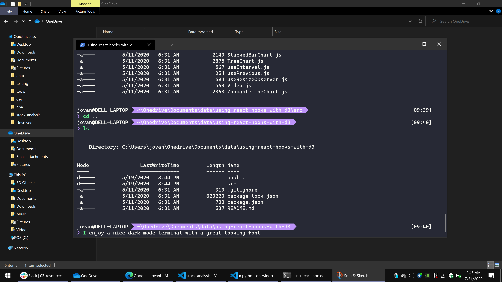

_The opinionated and easiest way to fully install a Python Dev Env on Windows 10 for Data Analysis_.

## Python on Windows

## Table of Contents

- [Overview](#Overview)
- [Git on Windows](#GitOnWindows)
- [Node.js](#Node)
- [Windows Terminal](#WindowsTerminal)
  - [Windows Terminal Pretty](#WindowsTerminalPretty)
- [Visual Studio Code](#VisualStudioCode)
  - [Visual Studio Code Plugins](#VisualStudioCodePlugins)
- [Python](#Python)
  - [Anaconda](#AnacondaIndividualEdition)
  - [Windows Store](#WindowsStorePython)
- [Closing](#Closing)
- [Todo Checklist](#TodoChecklist)
- [Contributing](#Contributing)
- [License](#License)

## Overview

## Git on Windows

You need a version control system to be part of the software community. The of the most used code management systems is Git.

[Git Download](https://git-scm.com/downloads)

I'm just focused on Windows 10, so just click on the Windows version and the download would automatically start and it will prompt through install options.

> [Git Documentation](https://git-scm.com/doc)

## Node.js

Node?!? I thought this was just for Python?

Yes, but the ecosystem is so tightly coupled - you don't have to write JavaScript or TypeScript but you will that plugins and tools that make Python development a pleasure require Node as a Runtime.

[Node](https://nodejs.org/en/)

You want to install the LTS version of Node. LTS is just the Long Term Service product commitment that adheres to stable and long term releases and care. Just like the Git install you just have to click through the options as you install.

> [Node Documentation](https://nodejs.org/en/docs/)

## Windows Terminal

You have to deal with Git, You have to deal with Node, You have to deal with Python ... you have to deal with the command line. Command line?

Yes, the first user interface that allows you to navigate, enter commands, and monitor system feedback and workings. Daunting at first, but powerful as time proceeds.

To recap: - Installed [Git on Windows](#GitOnWindows) - Installed [Node.js](#Node)

... both tools work through the command line that we access through a terminal, the terminal we will be using is Windows Terminal. [Windows Terminal](https://www.microsoft.com/en-us/p/windows-terminal/9n0dx20hk701?activetab=pivot:overviewtab)!

But why? Installing Git and Node were pretty easy, we've downloaded an installer, double clicked, and went through the options. Windows Terminal on Windows 10 is even easier...

The Windows Store allows us to the same we did with Git and Node but in this case we just click on the install button and Microsoft handles the options and THEY ALSO MAINTAIN AND UPDATE THE SOFTWARE FOR US...we could make it look amazing.

> [What is Windows Terminal?](https://docs.microsoft.com/en-us/windows/terminal/)

### Windows Terminal Pretty

> We are going to spend lots of time in the Terminal, have fun and make it look nice! :)

## Visual Studio Code

Ok, maybe not that much time in the Terminal, because we are actually going to be living in our coding environment. This is the most important section for those who are starting out on coding and setting up a development environment.

One of the best ways to learn is try, fail, get feedback, rethink, try, fail, get feedback, and on forever.

Visual Studio Code is an amazing code editing and development tool - it could be lightweight or customized to be a full IDE development.

[Visual Studio Code](https://code.visualstudio.com/Download) once you download and go through the options.

> [Visual Studio Code Docs](https://code.visualstudio.com/docs)

### Visual Studio Code Plugins

> I've mentioned that one of the best ways to learn is to try, fail, and get feedback... but you need to setup the habits, tools, and envirnment to make it work ... they are called plugins...

- [Python extension for Visual Studio Code](https://marketplace.visualstudio.com/items?itemName=ms-python.python)
- [Visual Studio IntelliCode](https://marketplace.visualstudio.com/items?itemName=VisualStudioExptTeam.vscodeintellicode)
- [Emmet](https://docs.emmet.io/) <- Already installed
- [Bookmarks](https://marketplace.visualstudio.com/items?itemName=alefragnani.Bookmarks)
- [GitLens — Git supercharged](https://marketplace.visualstudio.com/items?itemName=eamodio.gitlens)
- [indent-rainbow](https://marketplace.visualstudio.com/items?itemName=oderwat.indent-rainbow)
- [Spell Right](https://marketplace.visualstudio.com/items?itemName=ban.spellright)

## Python

There are some ways to install Python on Windows 10 - but this is an opinionated take with three goals:

- Easy to Follow
- Easy to Maintain
- Easy to Learn

### Anaconda Individual Edition

This is the way! :)

[Windows Download](https://www.anaconda.com/products/individual#windows)

[Installing on Windows](https://docs.anaconda.com/anaconda/install/windows/)

### Windows Store Python

Just like we downloaded the Windows Terminal through the Windows Store where we could easily install a piece of software and have Microsoft worry about - we could the do with Python.

[Python from the Windows Store](https://www.microsoft.com/en-us/p/python-38/9mssztt1n39l?activetab=pivot:overviewtab)

Yes, you could download python from https://www.python.org/ BUT actually this the also the official Python Software Foundation download with the extras of the Store automatically updating to the latest version and managing our system path.

## Closing

Go forth and play:

- [Python in Visual Studio Code](https://code.visualstudio.com/docs/languages/python)
- [Getting Started with Python in VS Code](https://code.visualstudio.com/docs/python/python-tutorial)
- [Data Science in Visual Studio Code](https://code.visualstudio.com/docs/python/data-science-tutorial)

BUT

- [JupyterLab](https://jupyterlab.readthedocs.io/en/stable/getting_started/overview.html)

> Once you've downloaded all these amazing tools you'll enter a community of developers, makers, coders, problem solvers BUT these are just tools and setup - the real work is still done by thinking out the problems and planning out solutions.
