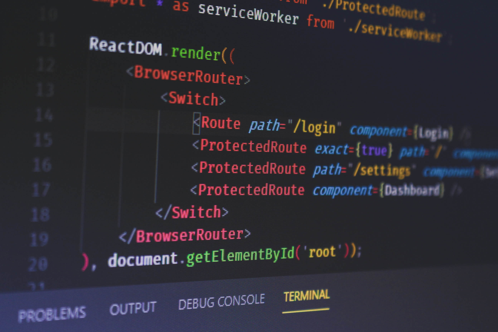

_Are you sure you would like to start learning React? Read below._.

I'll have to start off with asking you a question, are you sure you want to learn React? I ask, because I want to know your motives and end goal. If you recently started browsing developer positions and saw React was a job demand, then yes; but if you just want to create a website and learn - in good conscious I would suggest you start off with [Eleventy](https://www.11ty.dev/)\*\* If you are building your skill set [React](https://reactjs.org/docs/getting-started.html) is a popular and solid frontend framework library; its what we use at Measured Studios.

Start thinking in React - React made popular the notion of components. components are this piece of code that is as big or as small and encapsulates the markup, stylings, and interactions and part of a larger component tree. I encourage you to read through the React docs and search for articles, videos, and code snippets to get a greater understanding. But just know you are now thinking in React, following community beat practices, and learning the idioms.

Before you start coding, plan.

LAYOUT MY OWN WAY TO PLAN OUT WORK

Once you have a simple wireframe jump on [CodeSandbox](https://codesandbox.io/s/new) and which will start a new create-react-app and start hacking your design within the App component.

**Eleventy Resources**

- [HTML](https://developer.mozilla.org/en-US/docs/Learn/HTML)
- [CSS](https://cssreference.io/)
- [JavaScript](https://javascript.info/)
- [Eleventy Docs](https://www.11ty.dev/docs/)
